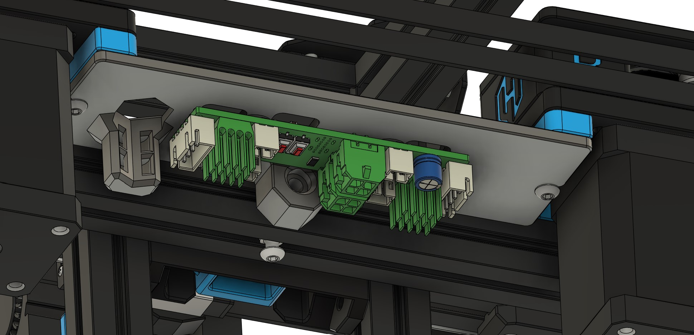

# GBB15 Motor Panel Mount

This mod mounts the GBB15 in place of the motor panel. The board is mounted so that the MCU and motor drivers can be heat sinked into the chamber. The Bowden tube and CAN harness can be zip tied in place through the hexagon hole into the chamber. Two M3 heatset inerts are required mount the GBB15 to the panel.

