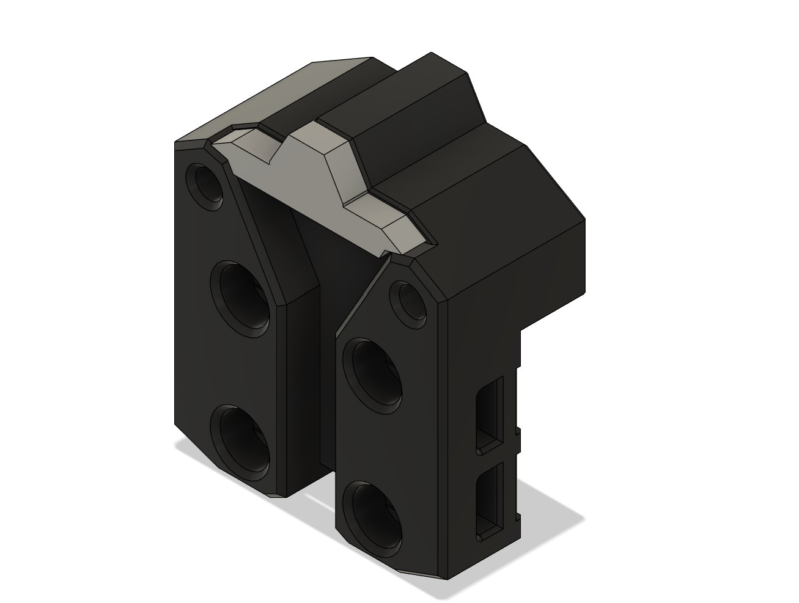

# Offset X-Carriage for Hex-Burner

This mod offsets the placement Hex-Burner toolhead 2mm forward. A support piece is included in the STL, and can be removed after printing.

The intent of offsetting the toolhead is for: 
- Routing of all toolhead wires in the carriage channel.
- Clearing the Pi Camera with using the popular Voron 0 Raspberry Pi Camera Mount by johanncc. Depending on the size of the camera PCB, the mount corner of the PCB may need to be trimmed. 
- Allowing excees belt to extend out the side of the carriage without affecting toolhead alignment. 

The disadvantage to this mod is that you will lose 2mm of Y-axis travel; however, this is negligible in many cases, especially if you are using the mini-fridge door mod.

