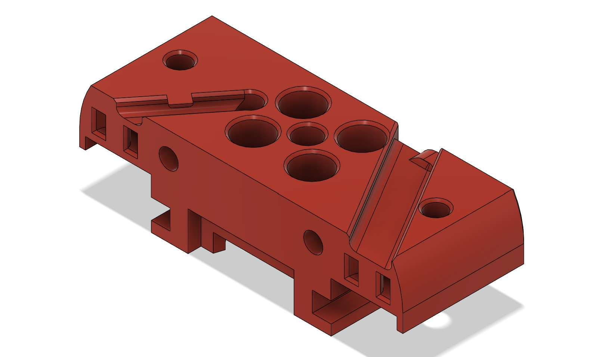
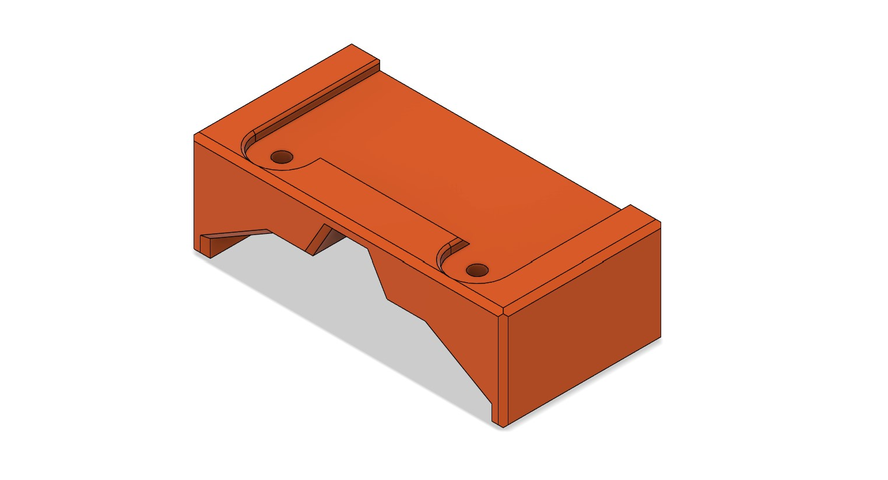
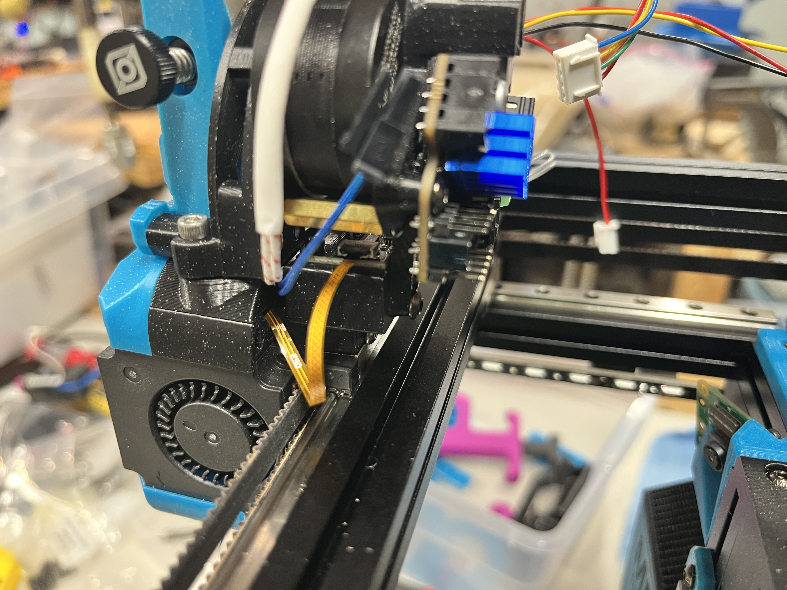
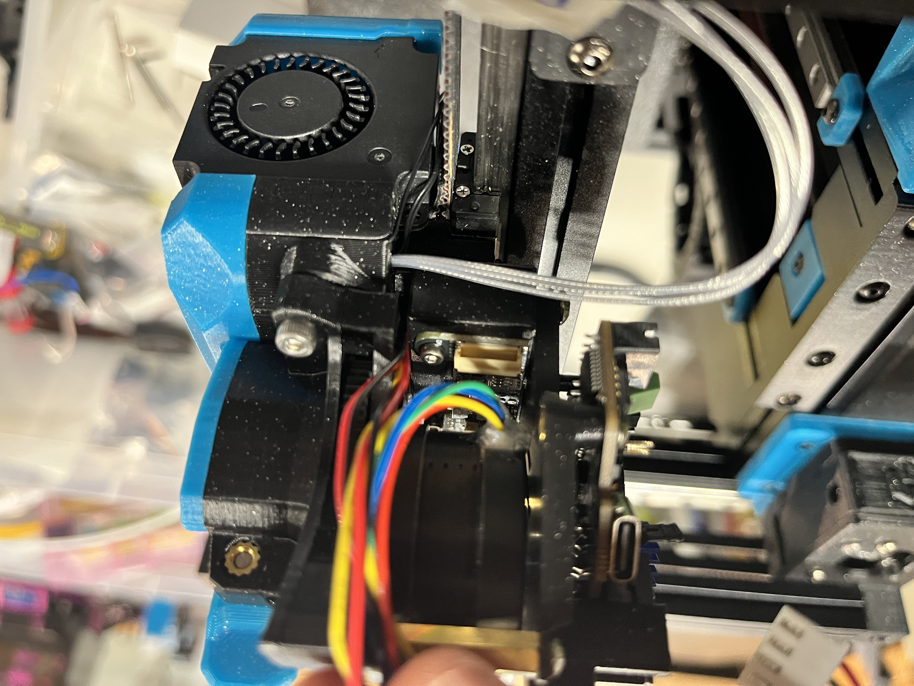
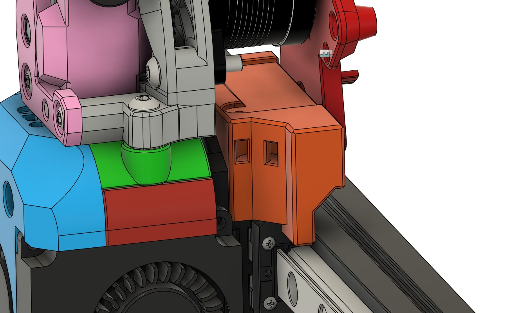
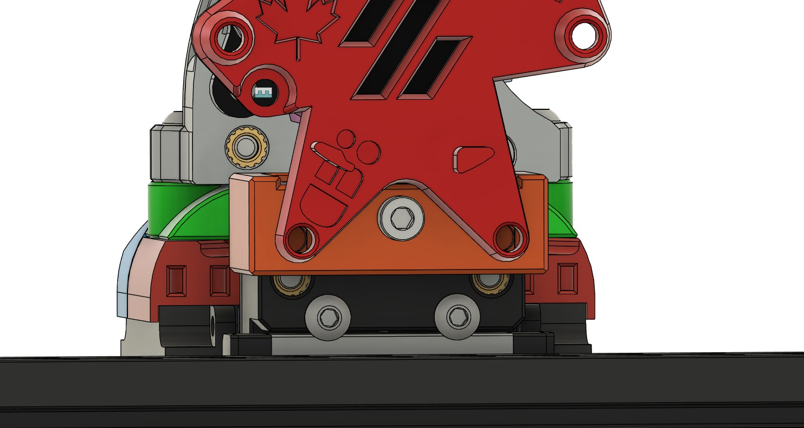

# Revo PZ Mods for Hex-Burner

This is a set of STLs to use the Revo PZ with the Hex-Burner. 

## Hex-Burner Revo PZ Sherpa Mount
The Revo PZ Sherpa Mount is used to provide a routing path of the PZ's flex cable through the top and out of the back of the toolhead. This part is compatible with the Hex-Burner's fastener spacing and any Sherpa style extruder.

## X-Carriage Revo PZ Board Mount
The X-Carriage Revo PZ Board Mount is used to mount the PZ's breakout board on top of the Hex-Burner X-Carriage and under the extruder motor. Optionally, there is a version with an extended X-axis bumper and zip-tie point for the hot end wires. The bumper is placed to impact the XY joints during sensorless homing. This mount will require the top toolhead screw to be 2mm longer. Two M3 heatset inerts can be added for an attachment point with toolhead MCU mounts. The image below shows the Maple Leaf Makers EBB36 interfacing with this mount

