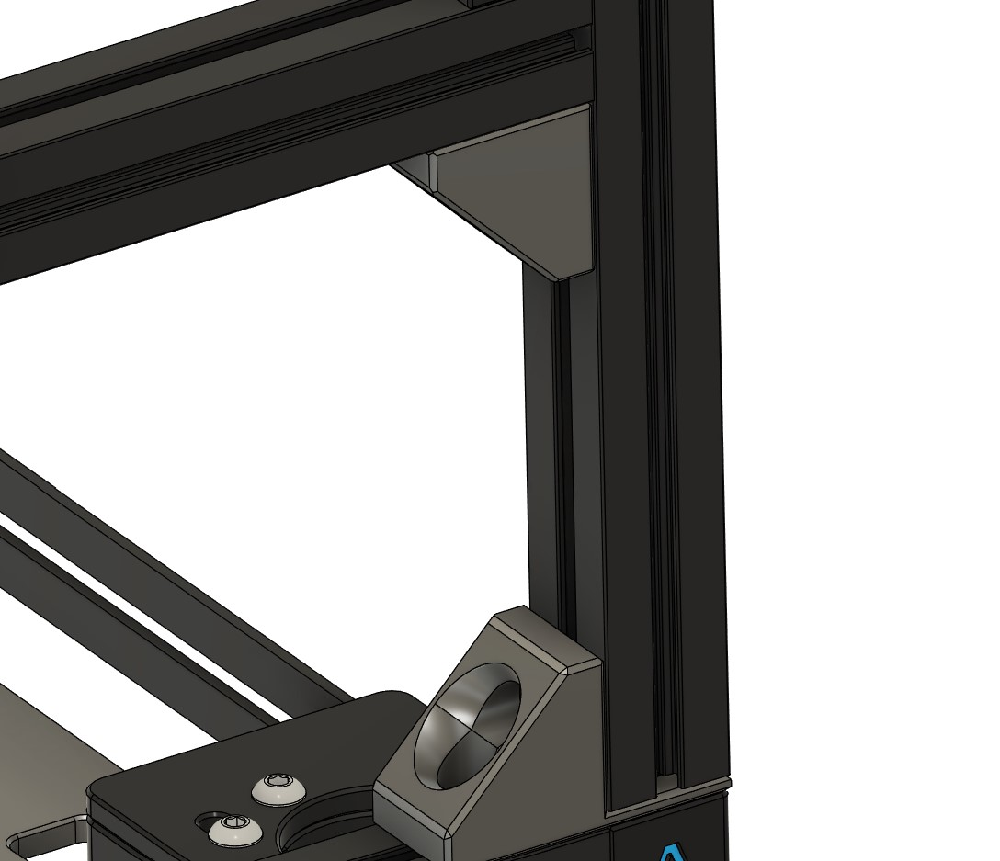
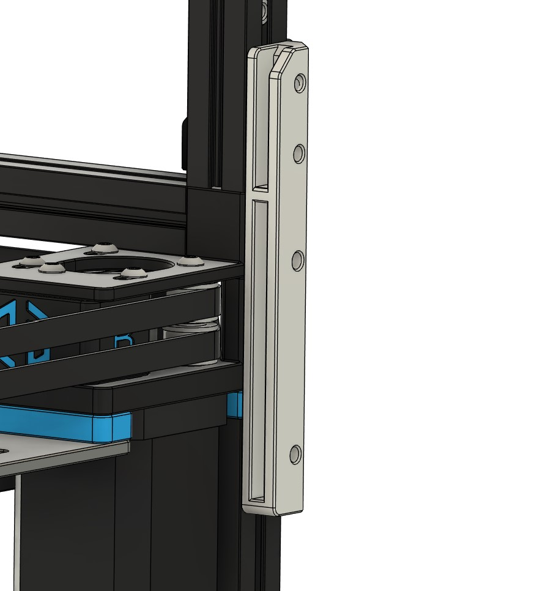

# Top Hat Braces

This mod is a colletion of STLs to secure the top had to the printer.

The corner brace with 2mm offset can be used for mini-fridge mod users needing to extend the height of the top hat. Additional nuts will need to be preloaded into the top hat extrusions.

The rear brace interfaces with existing mount points and had a slot for the Voron0 rear panels.

