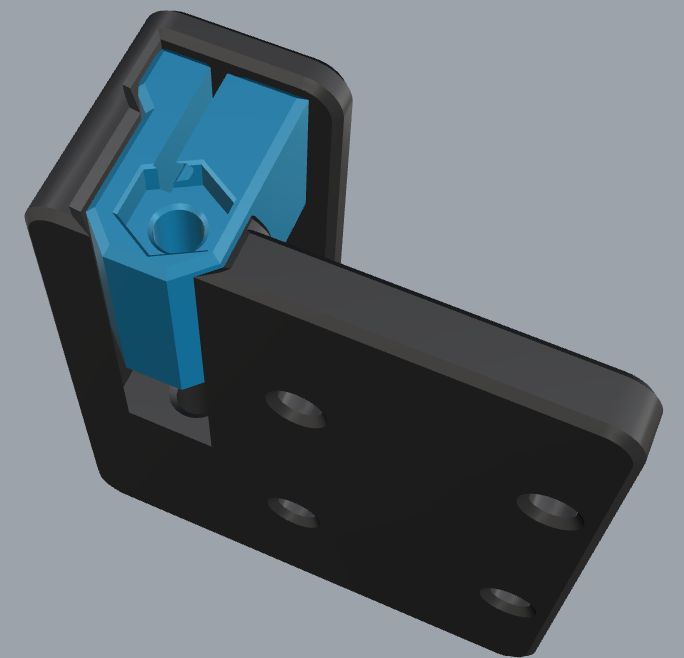

# Front belt blocks for HexZero

## The idea for the mod
I made a mod for the front belt blocks.  
On my assembly i run into issues, when tension the front belts, that the tension force was bigger then de clamping force.  
The result was, that the belts jump out of the original blocks. 

## Which 3d parts are shared
Only the 3D printed parts for the PurgeBucket are shared.  
The bed-mount is mantaray and hammerhead bed compatible.

## Hardware needed for this mode
- 2x M2 nut
- 2x M2x25 or M2x30 (depends which version you print)

## Details about the version
When you take the version for the M2x25 screws, then the screws will drop deeper inside the rail block.  
If you want the screws flush with the top. Then there is a version for M2x30 screws. These screws will stick out by 2mm on the underside.  
But this should be no problem, because the cutouts in the bottom plate are big enough that the screws will drop in these cutouts.  
