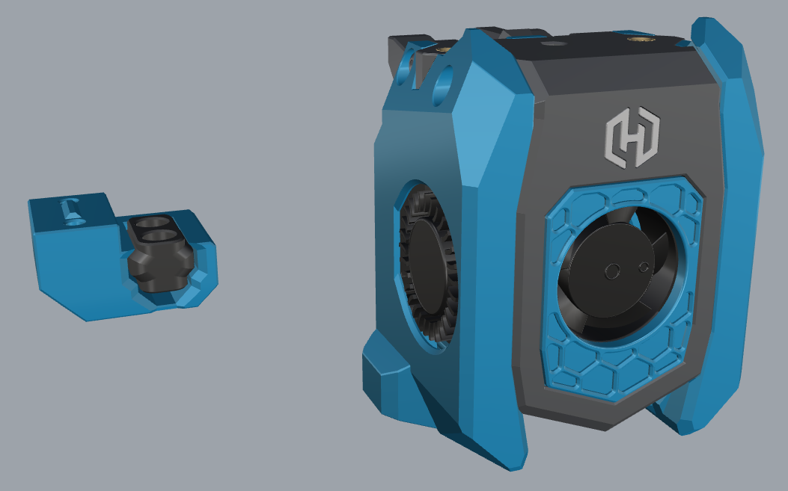

# &#x2B22; AntHead for HexZero &#x2B22;

# Mod Guide
Mods specially for the AntHead, to get it fit to the HexZero.  
By default, the AntHead has to probe on the back, that isn't going to work on the HexZero.  
Therefor, the left duct is changed, to add zeroclick.

## Where to find the missing parts?
Only the changed parts can be downloaded. For all other parts, see the AntHead github.  
https://github.com/PrintersForAnts/AntHead

The zeroclick parts can be found:  
https://github.com/zruncho3d/ZeroClick

## What are the changed parts in this mod:
- Left ducting
- Main body O2 with HX0 logo
- Main body sherpa with HX0 logo
- Led diffuser HX0 logo
- Led light shield HX0 logo
- ZeroClick dock for HX0

## Optional
- Carriage mount

## Work for the future
- Finished the HX0 servo dock, for zero click on HX0_Anthead
