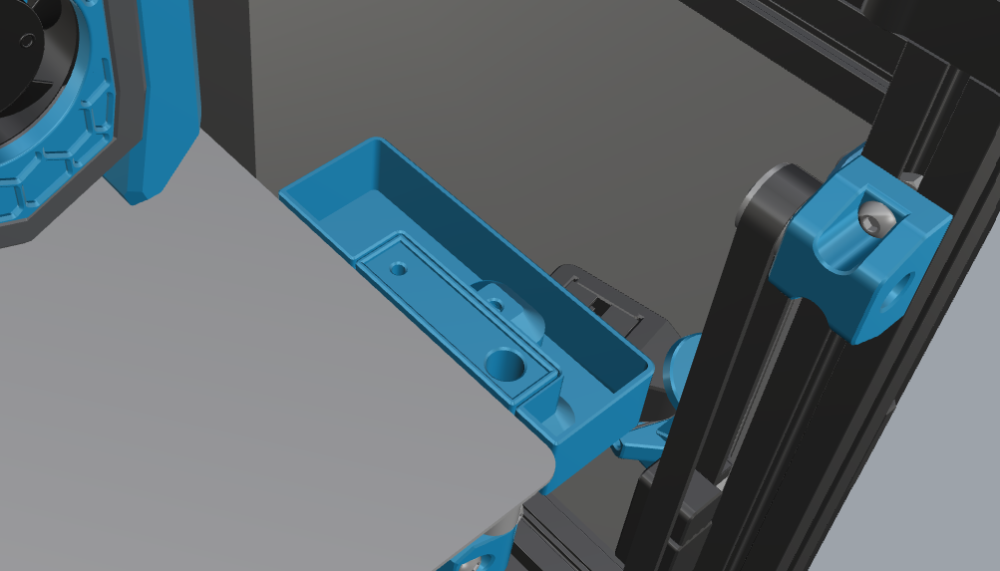

# PrugeBucket for HexZero, mantaray and hammerhead bed compatible

## Which 3d parts are shared
Only the 3D printed parts for the PurgeBucket are shared
The bed-mount is mantaray and hammerhead bed compatible

## Hardware needed for this mode
- 2x M3x8
- 2x M3 nut
- 2x Magnet 6x3
- 1x Nozzle silicone brush (Bambu A1)
