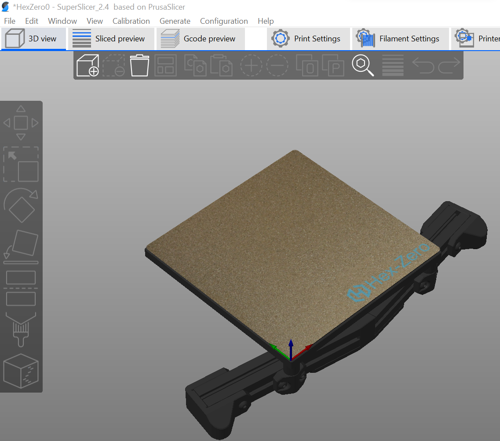
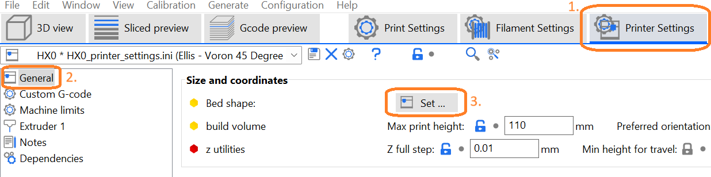
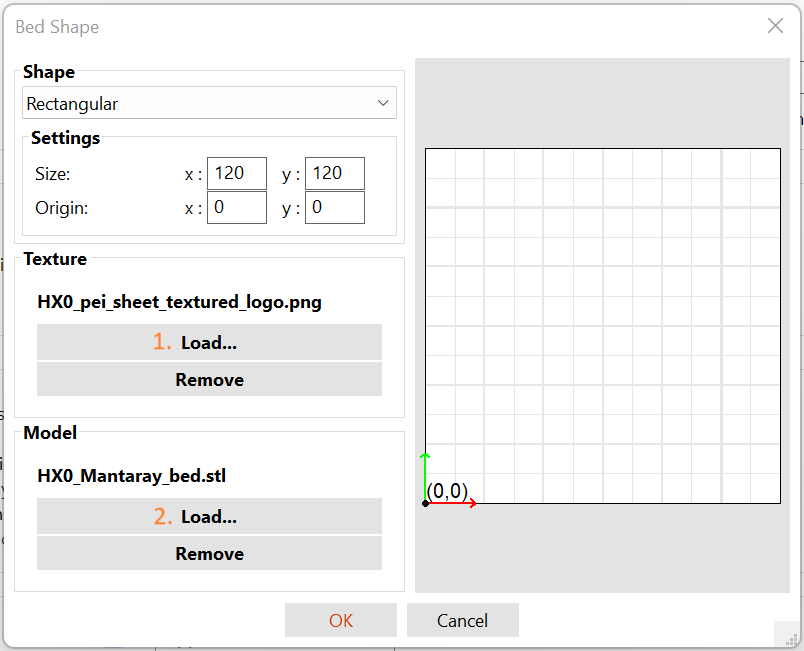

# HexZero texture and model for SuperSlicer

This is not a 3d mod, but files to import the HexZero into your SuperSlicer  

## How to change to bed + sheet in SuperSlicer
- Open SuperSlicer  
- Go to <b>Printer settings</b>
- Choose <b>General</b>
- Choose <b>Set</b>

  
 
- A option <b>Texture</b> choose <b>Load</b> and search for the .png file 
- A option <b>Model</b> choose <b>Load</b> and search for the .stl file

  
